本节来分析一下http协议，稍再总结一份HTTP协议详解吧！放个坑在这里待填-哈哈
# 1、利用wireshark抓包，如图：

话说现在都是https了，特意想找个http网页也麻烦

图中开始就是三次握手，HTTP使用TCP作为它的支撑运输协议。基于tcp链接的数据报文传输前必须建立三次握手，我们先分析一下前三个tcp报文。
## 第一个报文
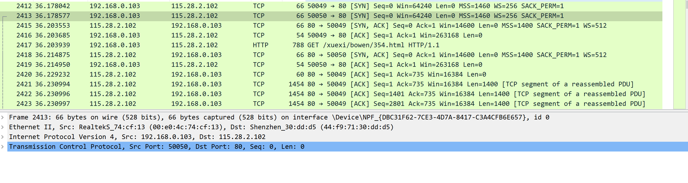
这是第一个报文，它是由:tcp-->ip--->eth--->frame, 没有数据报文，说明第一个tcp不携带数据，同样其余两个也一样都是握手信号，只有握手成功，才能传递数据。

如何判别它是握手信息还是数据报文呢---->我们再进一步分析
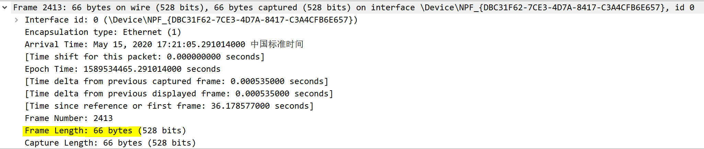
帧长度为66字节
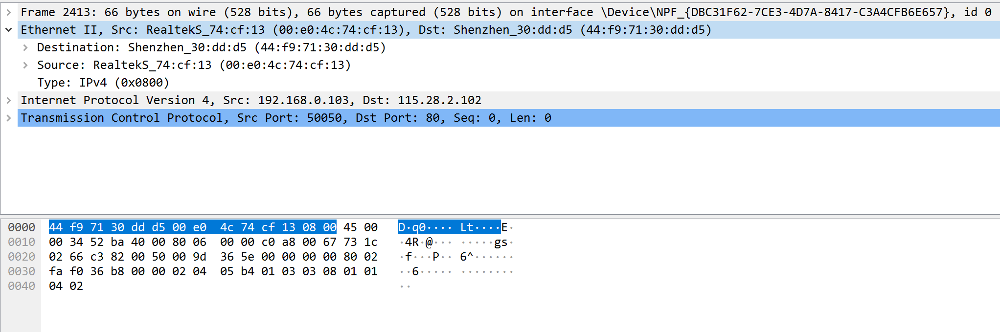
MAC头为14字节
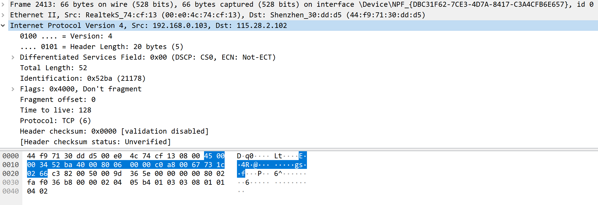
IP头为20字节
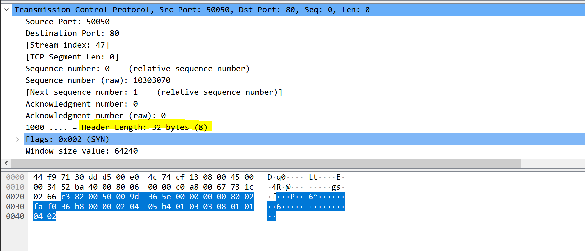
TCP头部一般为20~60字节，此处TCP头为32字节

可见，整个报文只有 MAC头+IP头+TCP头，没有携带数据。

### 我们返回去重新看一下MAC头部信息
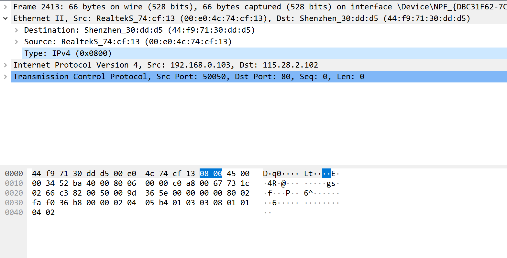
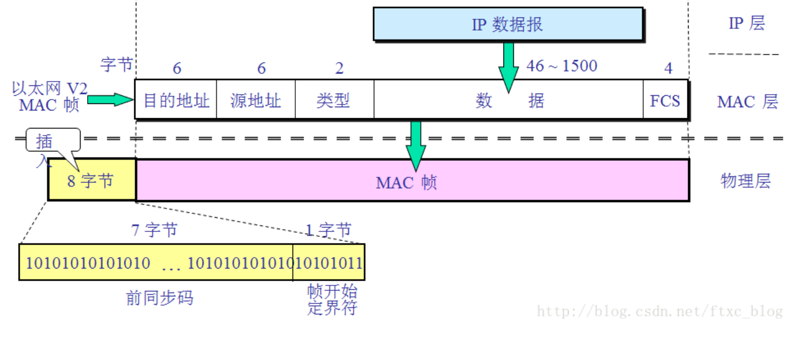
它指定src_mac 和 dst_mac 和ip层协议ipv4 = 0x0800(2bytes)--2个字节标识出以太网帧所携带的上层数据类型（如0x0800代表上一层是IPv4协议，0x0806为arp, 0x86DD为IPv6）
### 继续看IP头
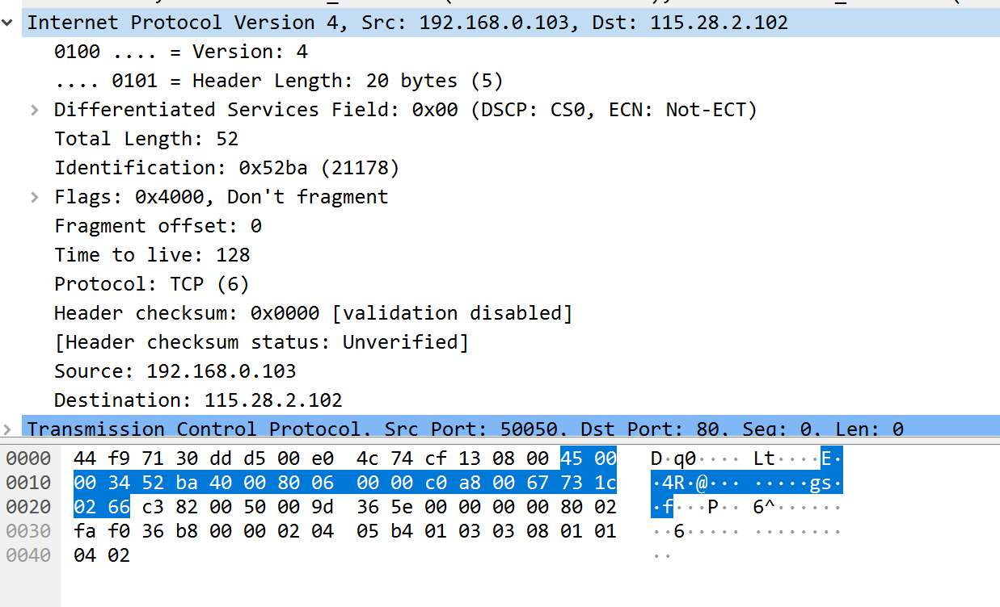
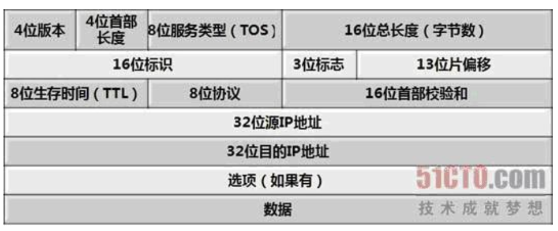
它指明

version:4  

ip_header_length = 20bytes

differentiated services field :0x00  ---区分服务

标识(identification)：该字段标记当前分片为第几个分片，在数据报重组时很有用

标志（flag）：该字段用于标记该报文是否为分片（有一些可能不需要分片，或不希望分片），后面是否还有分片（是否是最后一个分片）。

片偏移：指当前分片在原数据报（分片前的数据报）中相对于用户数据字段的偏移量，即在原数据报中的相对位置。

生存时间：TTL（Time to Live）。该字段表明当前报文还能生存多久。每经过1ms或者一个网关，TTL的值自动减1，当生存时间为0时，报文将被认为目的主机不可到达而丢弃。

协议：该字段指出在上层（网络7层结构或TCP/IP的传输层）使用的协议，可能的协议有UDP、TCP、ICMP、IGMP、IGP等

首部校验和：用于检验IP报文头部在传播的过程中是否出错，主要校验报文头中是否有某一个或几个bit被污染或修改了。 

源IP地址：32位（bit），4个字节，每一个字节为0～255之间的整数，及我们日常见到的IP地址格式。 

目的IP地址：32位（bit），4个字节，每一个字节为0～255之间的整数，及我们日常见到的IP地址格式。

### 再来看看TCP头部
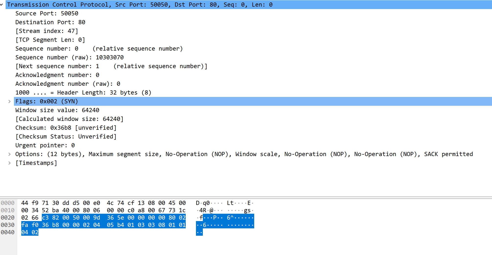
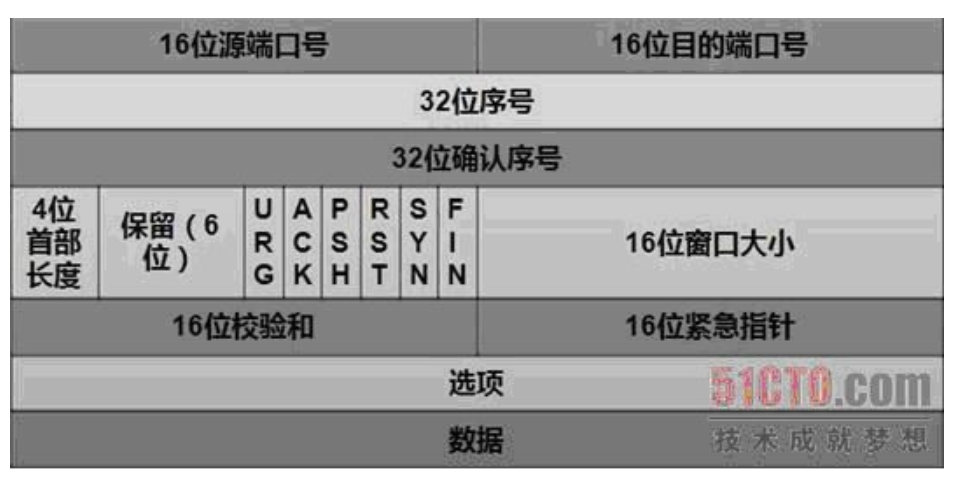
tcp报文中指出了src_port和dst_port （此处我们是HTTP协议，目的端口为80）

tcp segmet len: 没有分片

seq = 0, ack = 0，是TCP可靠传输的关键部分

tcp_header_length = 40

数据偏移／首部长度：4bits。由于首部可能含有可选项内容，因此TCP报头的长度是不确定的，报头不包含任何任选字段则长度为20字节，4位首部长度字段所能表示的最大值为1111，转化为10进制为15，15*32/8 = 60，故报头最大长度为60字节。首部长度也叫数据偏移，是因为首部长度实际上指示了数据区在报文段中的起始偏移值。

flags标志很有作用
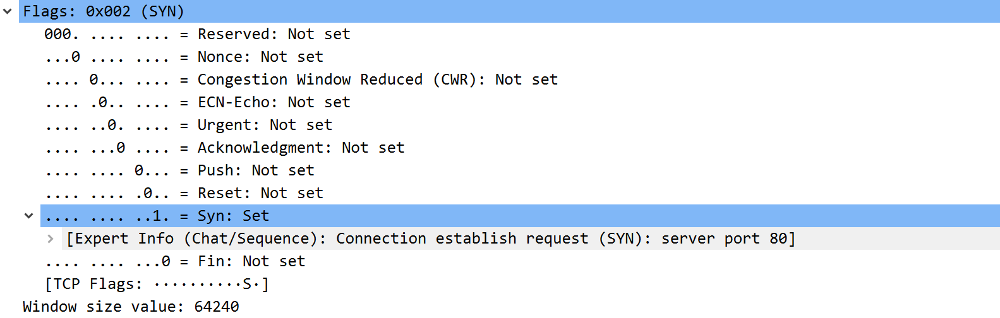
这个有几个标志位，置1则表示对应信号

congestion --拥塞

acknowledgment--应答应答

push       --发送数据

rst      --隔特定时间没有收到应答信号，再发送

syn        --同步信号

fin        --断开信号

urg        --紧急指针

窗口（window size value ）0：滑动窗口大小，用来告知发送端接受端的缓存大小，以此控制发送端发送数据的速率，从而达到流量控制。窗口大小时一个16bit字段，因而窗口大小最大为65535。

校验和（checksum）：奇偶校验，此校验和是对整个的 TCP 报文段，包括 TCP 头部和 TCP 数据，以 16 位字进行计算所得。由发送端计算和存储，并由接收端进行验证。

紧急指针（urgent pointer）：只有当 URG 标志置 1 时紧急指针才有效。紧急指针是一个正的偏移量，和顺序号字段中的值相加表示紧急数据最后一个字节的序号。 TCP 的紧急方式是发送端向另一端发送紧急数据的一种方式。

选项和填充（maxinum segment size）：最常见的可选字段是最长报文大小，又称为MSS（Maximum Segment Size），每个连接方通常都在通信的第一个报文段（为建立连接而设置SYN标志为1的那个段）中指明这个选项，它表示本端所能接受的最大报文段的长度。选项长度不一定是32位的整数倍，所以要加填充位，即在这个字段中加入额外的零，以保证TCP头是32的整数倍。

数据部分： TCP 报文段中的数据部分是可选的。在一个连接建立和一个连接终止时，双方交换的报文段仅有 TCP 首部。如果一方没有数据要发送，也使用没有任何数据的首部来确认收到的数据。在处理超时的许多情况中，也会发送不带任何数据的报文段。

此处分析了3次握手的第一次，其他两个报文信息类似

下一节我么来分析HTTP请求和响应
————————————————

参考链接原文链接：https://blog.csdn.net/qq_37352183/article/details/80722325